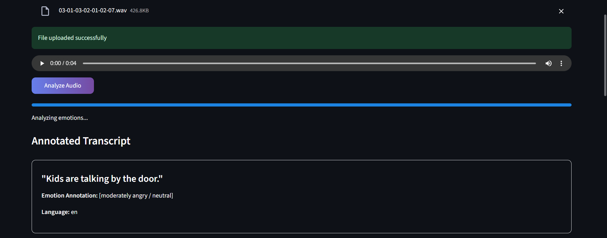
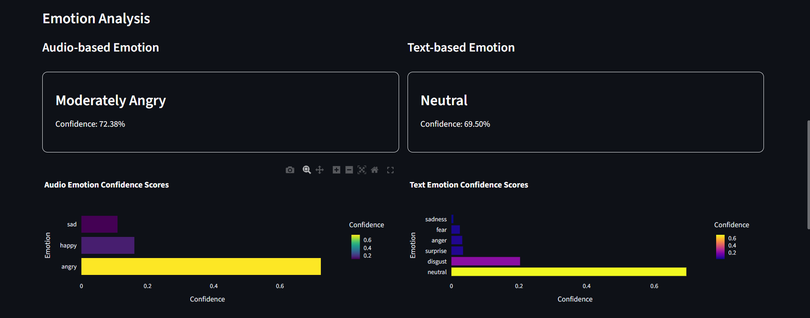
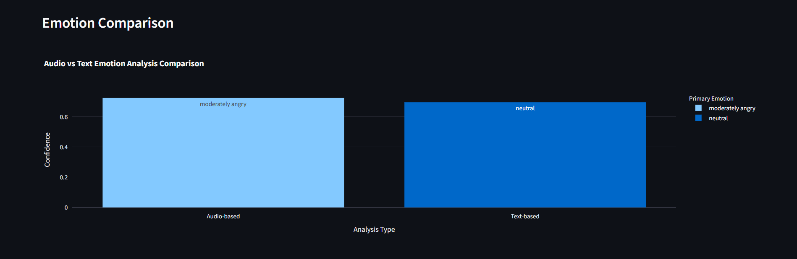

# Emotion-Aware ASR

An advanced speech recognition system that goes beyond transcription to detect emotional context in spoken language. This student project combines OpenAI's Whisper for speech recognition with emotion detection models to analyze both vocal patterns and textual content.

This is an individual student project developed to explore the intersection of speech recognition and emotion detection. The goal was to create a practical application that demonstrates how AI can understand not just the words we say, but the emotional context behind them.

## 🌟 Features

- **Dual Emotion Analysis**: Detects emotions from both audio characteristics and textual content
- **Multi-language Support**: Automatic language detection with Whisper ASR
- **Real-time Processing**: Fast analysis with cached models for better performance
- **Interactive Visualizations**: Beautiful charts comparing audio vs. text emotions
- **Web Interface**: User-friendly Streamlit application

## 🚀 Live Demo


## 📊 Sample Results

### Transcript with Emotion Annotation


### Emotion Analysis Dashboard


### Audio vs Text Emotion Comparison


## 🛠️ Installation

1. **Clone the repository**
   ```bash
   git clone https://github.com/antarades/emotion-aware-automatic-speech-recognition.git
   cd emotion-aware-automatic-speech-recognition
   ```

2. **Install dependencies**
   ```bash
   pip install -r requirements.txt
   ```

3. **Install system dependencies** (for audio processing)
   ```bash
   
   # macOS
   brew install ffmpeg
   
   # Windows 
   choco install ffmpeg
   ```

## 🎯 Usage

### Web Application
```bash
streamlit run app.py
```

### Command Line Interface
```bash
# Analyze an audio file
python src/pipeline.py --mode file --audio_file path/to/audio.wav

# Record and analyze audio via terminal
python src/pipeline.py --mode record
```

## 📁 Project Structure

```
emotion-aware-asr/
├── src/
│   ├── asr_whisper.py      
│   ├── emotion_model.py    
│   ├── pipeline.py         # CLI pipeline
│   ├── record_audio.py     # Terminal audio recording utility
├── app.py                  # Streamlit web application
├── home-image.svg          # Home Page illustration
├── requirements.txt        
└── README.md
```

## 🧠 Models Used

### Speech Recognition
- **OpenAI Whisper** (small variant): Accurate speech-to-text conversion with multi-language support

### Emotion Detection
- **Audio Analysis**: `superb/wav2vec2-base-superb-er` - detects anger, happiness, neutrality, and sadness from vocal patterns
- **Text Analysis**: `j-hartmann/emotion-english-distilroberta-base` - detects joy, sadness, anger, fear, surprise, disgust, and neutrality from text content

## 🔮 Future Enhancements

- **Web-based Audio Recording**: Direct audio recording capability within the web interface
- **Additional Language Support**: Expanded emotion detection for non-English languages

## 🎨 Customization

You can customize the application by:

1. **Model Size**: Adjust the Whisper model size in `app.py` (tiny, base, small, medium, large)
2. **Language Forcing**: Force specific language detection in the transcribe_audio function
3. **Emotion Thresholds**: Modify confidence thresholds in `emotion_model.py`
4. **UI Styling**: Customize the Streamlit interface in the CSS section of `app.py`

## 📈 Performance Notes

- The small Whisper model provides a good balance between accuracy and speed
- Emotion detection takes approximately 2-5 seconds depending on audio length
- Models are cached after first load for faster subsequent processing
- Current audio recording is terminal-based; web recording will be added in future versions

## 📄 License

This project is licensed under the MIT License.

## 🙋‍♀️ Author

Built by Antara Srivastava
📧 antarakyw05@gmail.com
🌐 github.com/antarades

